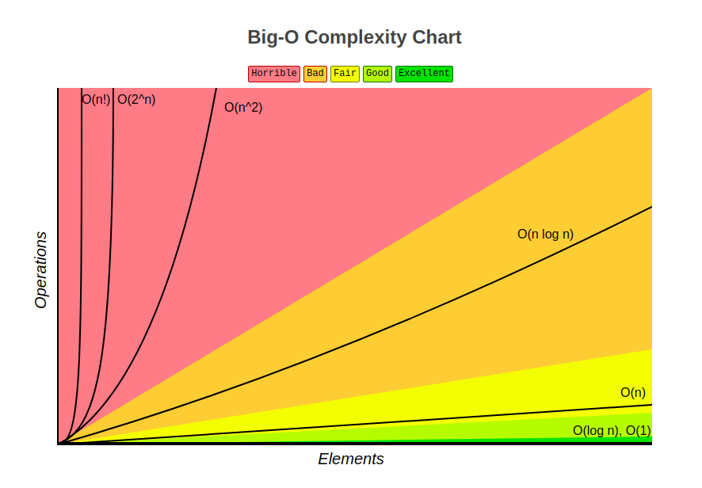

# Factorial Time Complexity

**Syntax:** O(<i>n</i>!)

> If Big O helps us identify the worst-case scenario for our algorithms, O(<i>n</i>!) is the worst of the worst.

**Why?**

Recall that a factorial is the product of the sequence of n integers.

For example, the factorial of 5, or 5!, is:

```
5 * 4 * 3 * 2 * 1 = 120
```

We will find ourselves writing algorithms with factorial time complexity when calculating permutations and combinations.

If we look at our chart, we see that our rate of growth is nearly vertical.



Why would anyone ever write an algorithm with factorial time complexity? It's not that we want to write terrible algorithms. The problem is the problems. There are some problems for which there is no easy solution.

## NP-Complete Problems

These are what are known as NP-complete problems. NP-complete is a concept in complexity theory used to describe a category of problems for which there is no known correct and fast solution. In other words, the solution to an NP-complete problem can be quickly verified, but there is no known way to quickly find a solution. It’s important to distinguish between two types of solution. There’s the solution as algorithm, i.e: the function that we can apply to any input to solve this problem. And there’s the solution as output, i.e: the specific value we want our function to return.

With NP-complete problems, we can prove our solution, as algorithm, will work on a small input, but the time to find a specific solution, as output, grows rapidly as the input size increases.

## tl;dr

Algorithms that create a factorial time complexity pattern increase n at a rate of n!. A factorial is the product of all integers less than that number (e.g., 5! would be 5 * 4 * 3 * 2 * 1).

## Example

finding the factorial of _n_, find all permutations of a given set / string.

```typescript
function factorial (n: number): number {
  let result = n;
  if (n === 0) {
    return 1;
  }
  for (let i = 0; i < n; i++) {
    result = n * factorial(n - 1);
  }
  return result;
}
```

<table>
  <tr>
    <td colspan="2">
      Content from this page was sourced from:
      <ul>
        <li><a href="https://medium.com/swlh/time-complexity-javascript-c572e3cbd269">Time Complexity & JavaScript | The Startup by Rachel Andersen</a></li>
        <li><a href="https://jarednielsen.com/big-o-factorial-time-complexity/">Big O Factorial Time Complexity | jarednielsen.com</a></li>
      </ul> 
    </td>
  </tr>
  <tr>
    <td width="50%">
      <a href="../exponential-time-complexity#polynomial-time-complexity"><- Exponential Time Complexity</a>
    </td>
    <td width="50%" align="right"> 
      <a href="../../data-structures/README.md#data-structures">Data Structures -></a>
    </td>
  </tr>
</table>
