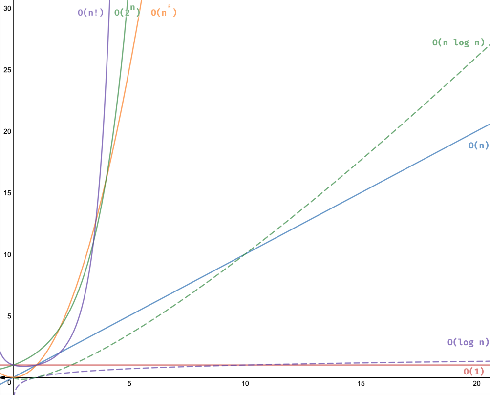

# Linearithmic Time Complexity

**Syntax:** O(_n_ log _n_)

> It is a combination of Linear and Logarithmic Time Complexities. The time taken by this is slightly less than the linear time complexity but not as slow as the quadratic time complexity.

Heap Sort and Quick Sort are some examples of Linearithmic Time Complexity. A linearithmic algorithm is sometimes referred to "log-linear".

## Example: Merge Sort

An example of an O(_n_ log _n_) algorithm would be a merge sort algorithm.

```typescript
function mergeSort<Type>(unsortedArray: Type[]): Type[] {
  // No need to sort the array if the array only has one element or empty
  if (unsortedArray.length <= 1) {
    return unsortedArray;
  }
  // In order to divide the array in half, we need to figure out the middle
  const middle = Math.floor(unsortedArray.length / 2);

  // This is where we will be dividing the array into left and right
  const left = unsortedArray.slice(0, middle);
  const right = unsortedArray.slice(middle);

  // Using recursion to combine the left and right
  return merge(
    mergeSort(left), mergeSort(right)
  );
}
```

Merge sort uses a "divide-and-conquer" strategy to sort the given array, Divide the array recursively until the elements are two or less. and it sorts the divided array recursively.

```typescript
function merge<Type>(left: Type[], right: Type[]): Type[] {
  const resultArray = [];
  let leftIndex = 0;
  let rightIndex = 0;

  // We will concatenate values into the resultArray in order
  while (leftIndex < left.length && rightIndex < right.length) {
    if (left[leftIndex] < right[rightIndex]) {
      resultArray.push(left[leftIndex]);
      leftIndex++; // move left array cursor
    } else {
      resultArray.push(right[rightIndex]);
      rightIndex++; // move right array cursor
    }
  }

  // We need to concat here because there will be one element remaining
  // from either left OR the right
  return resultArray
    .concat(left.slice(leftIndex))
    .concat(right.slice(rightIndex));
}
```

The final step was merging, It merges in taking one by one from each array such that they are in ascending order.

Some other examples of linearithmic algorithm Heap Sort and Quick Sort.

## Difference Between Logarithmic and Linearithmic Algorithms

Both logarithmic and linearithmic time complexity utilize logarithms and divide data, but note the key difference between the two algorithms. While the [binary search](../../../algorithms/searching-algorithms/binary-search/README.md#binary-search) algorithm continues to divide the input, half of that input was discarded each operation, repeatedly halving the amount of data to be evaluated. The merge sort algorithm repeatedly halved the input, but retained both halves and merged the sorted sub-Arrays. The retention and return of the full length of data that was inputted was necessary.

How does the performance of these time complexities compare?



Logarithmic time (O(log _n_)) is the _Powdered Toast Man_ of time complexities. It is highly performant and highly praised. It strays not far from constant time (O(1)). It is faster than linearithmic time.

Linearithmic time (O(_n_ log _n_)) is the _Muddy Mudskipper_ of time complexities—the worst of the best (although, less grizzled and duplicitous). It is a moderate complexity that floats around linear time (O(_n_)) until input reaches advanced size. It is slower than logarithmic time, but faster than the less favorable, less performant time complexities.

<table>
  <tr>
    <td colspan="2">
      Content from this page was sourced from:
      <ul>
        <li><a href="https://levelup.gitconnected.com/differentiating-logarithmic-and-linearithmic-time-complexity-976cd49c351b">Differentiating Logarithmic and Linearithmic Time Complexity | Level Up Coding by Dan Romans</a></li>
        <li><a href="https://tekolio.com/time-complexity-of-algorithms-explained-with-examples/">Time Complexity of Algorithms Explained with Examples | Tekolio by Ateev Duggal</a></li>
        <li><a href="https://javascript.plainenglish.io/javascript-merge-sort-3205891ac060">Time Merge Sort Algorithm in JavaScript | JavaScript in Plain English by Tim Han</a></li>
        <li><a href="https://medium.com/analytics-vidhya/big-o-notation-time-complexity-in-javascript-f97f356de2c4">Big O Notation — Time Complexity in Javascript | Analytics Vidhya by Esakkimuthu E</a></li>
      </ul>
    </td>
  </tr>
  <tr>
    <td width="50%">
      <a href="../logarithmic-time-complexity#logarithmic-time-complexity"><- Logarithmic Time Complexity</a>
    </td>
    <td width="50%" align="right"> 
      <a href="../polynomial-time-complexity/README.md#polynomial-time-complexity">Polynomial Time Complexity -></a>
    </td>
  </tr>
</table>
