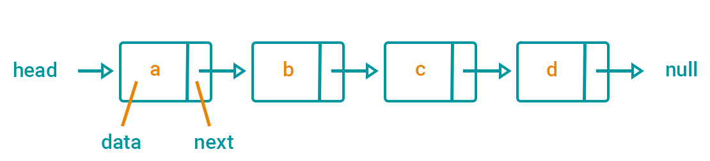

# Singly Linked List

> A linked list is a linear data structure similar to an array. However, unlike arrays, elements are not stored in a particular memory location or index. Rather each element is a separate object that contains a pointer or a link to the next object in that list.

> Each element (commonly called nodes) contains two items: the data stored and a link to the next node. The data can be any valid data type.

~ [How to Implement a Linked List in JavaScript by Sarah Chima Atuonwu | freeCodeCamp](https://www.freecodecamp.org/news/implementing-a-linked-list-in-javascript/)

