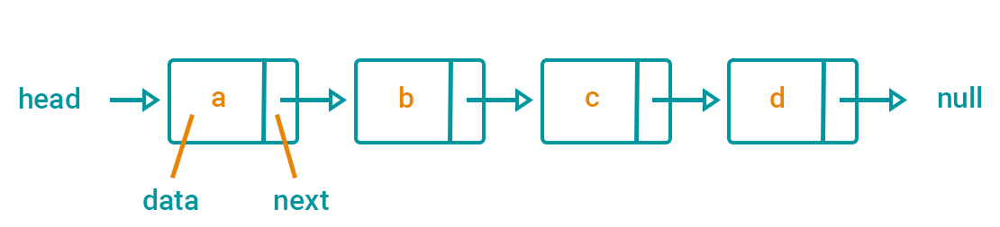

# Singly Linked List

> A linked list is a linear data structure similar to an array. However, unlike arrays, elements are not stored in a particular memory location or index. Rather each element is a separate object that contains a pointer or a link to the next object in that list.

> Each element (commonly called nodes) contains two items: the data stored and a link to the next node. The data can be any valid data type.

~ [How to Implement a Linked List in JavaScript by Sarah Chima Atuonwu | freeCodeCamp](https://www.freecodecamp.org/news/implementing-a-linked-list-in-javascript/)

# Characteristics

- Every element contains both data and a pointer to the next element. A "Singly Linked List" does not have a pointer to the previous element (a differentiating characteristic to the "Doubly Linked List").
- A pointer to a singly linked list is simply a pointer to the first element, or "head" of the list.
- As elements may be scattered anywhere in allocated memory, finding a specified element requires starting at the head and walking through the linked list - in worst case O(*n*) time.
- Because of the above, it can grow arbitrarily until available memory is exhausted.

# Pros

- While insertions and deletions of certain data structures, like an array, can be more expensive, these operations of a linked list can be done in constant time using pointers.

# Cons

- A linked list can waste space when over-allocated and unused as it **does not** occupy a contiguous memory locations.
- Finding an item of a linked list requires walking through the list - in worst case O(*n*) time vs an array which takes a constant time to retrieve an element or O(1).

