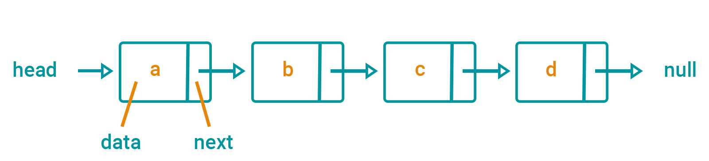

# Singly Linked List

> A linked list is a linear data structure similar to an array. However, unlike arrays, elements are not stored in a particular memory location or index. Rather each element is a separate object that contains a pointer or a link to the next object in that list.

> Each element (commonly called nodes) contains two items: the data stored and a link to the next node. The data can be any valid data type.

~ [How to Implement a Linked List in JavaScript by Sarah Chima Atuonwu | freeCodeCamp](https://www.freecodecamp.org/news/implementing-a-linked-list-in-javascript/)


<em>Figure 1: a simple Singly Linked List diagram</em>

# Characteristics

- Every element contains both data and a pointer to the next element. A "Singly Linked List" does not have a pointer to the previous element (a differentiating characteristic to the "Doubly Linked List").
- A pointer to a Singly Linked List is simply a pointer to the first element, or "head" of the list.
- As elements may be scattered anywhere in allocated memory, finding a specified element requires starting at the head and walking through the linked list - in worst case O(*n*) time.
- Because of the above, it can grow arbitrarily until available memory is exhausted.

# Pros

- While insertions and deletions of certain data structures, like an array, can be more expensive, these operations of a linked list can be done in constant time using pointers.


<em>Figure 2: an illustration of deletion efficiency. By using pointers, deletions occur in constant time O(1)</em>

# Cons

- A linked list can waste space when over-allocated and unused as it **does not** occupy a contiguous memory locations.
- Finding an item of a linked list requires walking through the list - in worst case O(*n*) time vs an array which takes a constant time to retrieve an element or O(1).

# Example Implementation

In [this example](./index.ts) we have a class `SinglyLinkedList` that accepts the `head` node upon instantiation like so. We can predefine the a "node"s `next` property or allow the default `null` value (see full example at the bottom).

```typescript
const headNode = new LinkedListNode('a');
const list = new SinglyLinkedList(headNode);
```

This implementation provides some extra helper methods:

#### `SinglyLinkedList.find`

This methods walks through each link until it finds a matching node based on the provided predicate function (similar to `Array.find`).

#### `SinglyLinkedList.insert`

Inserts the provided node at the end of the linked list.

#### `SinglyLinkedList.remove`

This methods walks through each link until it finds a matching node based on the provided predicate function (similar to `Array.find`). It finds the node with a matching `next` node and simply re-assigns the pointing `next` property (figure 2).

#### Full Example

```typescript
const headNode = new LinkedListNode('a');

// without the line below, `headNode.next` would be `null`
headNode.next = new LinkedListNode('b');

const list = new SinglyLinkedList(headNode);

// insert a node
list.insert(new LinkedListNode('c'));

// find the above inserted node "c"
const nodeC = list.find((node) => node.data === 'c');

// remove node "d", so the above will now point to "e"
list.remove((node) => node.data === 'b');

console.log(list.head.next.data); // "c"
```
